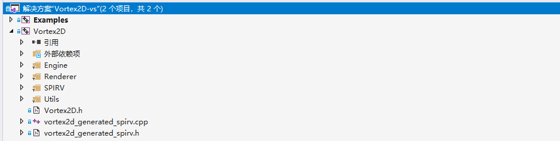
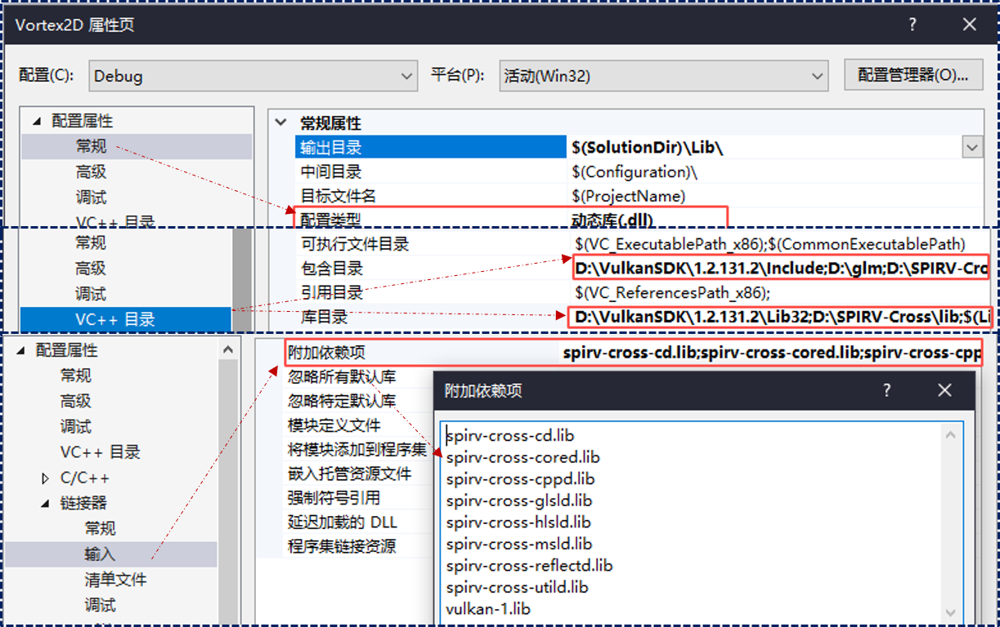
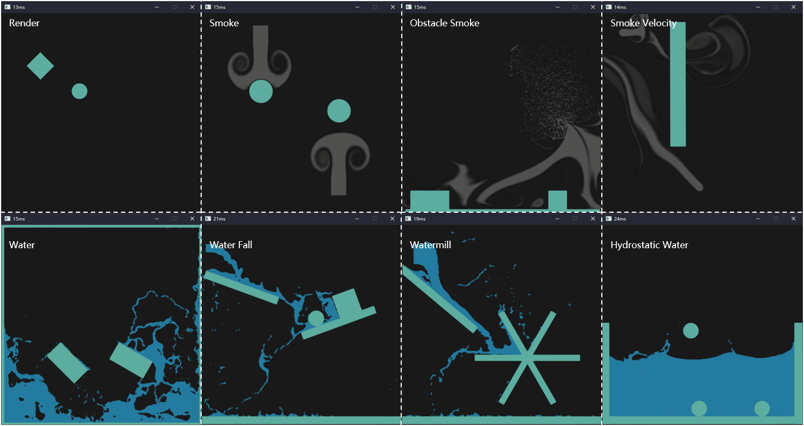

## Vortex2D on Visual Studio

> forked from [mmaldacker/Vortex2D](https://github.com/mmaldacker/Vortex2D)

### [Shader Compiling](./tools/scripts/)

```powershell
python .\GenerateSPIRV.py --compiler glslangValidator.exe --vulkan_version 1.2 --output vortex2d_generated_spirv --path .\shaders.txt

--path: 'list of glsl files'
--output: 'output file'
--compiler: 'location of spirv compiler'
--vulkan_version: 'vulkan version'
```

### Related Libraries

#### [Vulkan](https://vulkan.lunarg.com/sdk/home#windows)

#### [SPIRV-Cross](https://github.com/KhronosGroup/SPIRV-Cross)

#### [Box2D](https://github.com/erincatto/Box2D)

#### [glfw](https://www.glfw.org/index.html)

### Hierarchy & Configure

#### hierarchy



#### configure



### Examples



### License

[The MIT License (MIT)](LICENSE)

